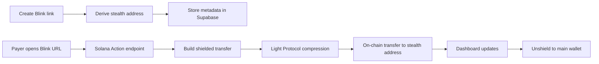
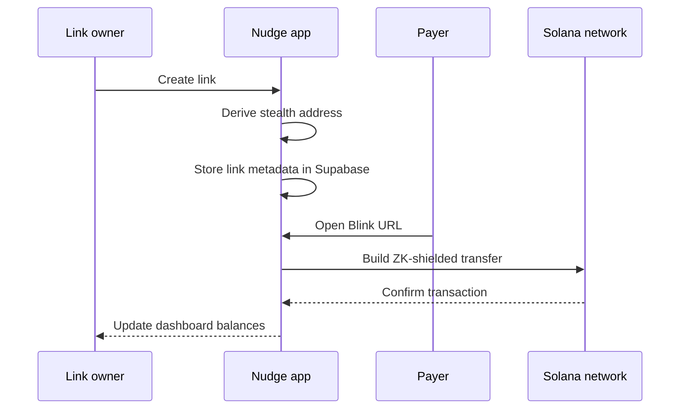

# Nudge

Nudge is a private payment link app on Solana that lets you accept SOL through shareable Blinks while keeping your main wallet address off-chain. It combines Noir zero-knowledge proofs with Light Protocol compression to route payments into stealth addresses that are deterministic, recoverable, and unlinkable.

Short version: Nudge makes private, shareable Solana payment links that settle to stealth addresses using ZK proofs and compression.

## Overview

Nudge provides a landing page, a public payment page, and a dashboard for creating and managing payment links. Each link maps to a stealth address derived from wallet signatures. Payers use a Blink URL to send SOL, and the system builds a ZK-shielded transaction using Light Protocol. The dashboard shows balances, link usage, and transactions, and lets the owner unshield funds back to a visible wallet.

## How it works



## Payment sequence



## Features

- Shareable Blinks for payments
- Custom slugs and link management
- Shielded transfers with ZK proofs
- Stealth address derivation and recovery
- Dashboard with balances, transactions, and link stats
- Unshield flow to move funds back to a main wallet
- Wallet adapter integration (Phantom, Solflare)

## Tech stack

- Next.js 16 and React 19
- Tailwind CSS and Radix UI components
- Solana Web3.js and Wallet Adapter
- Noir and Barretenberg for ZK proofs
- Light Protocol stateless SDK for compression
- Supabase for metadata and analytics

## Project structure

```
app/
	page.tsx                 Landing page
	[id]/[slug]/page.tsx     Public payment page for a Blink
	dashboard/               Authenticated dashboard
	api/
		actions/nudge/         Solana Actions Blink endpoint
		links/                 Link creation and CRUD
		light/                 Shielded balance and unshield helpers
		payments/              Confirmation and settlement
components/
	landing/                 Hero, features, and CTA sections
	dashboard/               Cards, stats, and link manager
	app/                     Auth dialogs and sidebar
lib/
	light.ts                 Light Protocol integration
	noir.ts                  Noir proof generation
	stealth.ts               Stealth address utilities
	supabase.ts              Supabase client
	types.ts                 Shared interfaces
contexts/
	auth-context.tsx         Wallet auth and user state
	user-context.tsx         Profile and preferences
supabase/
	schema.sql               Database schema
```

## Data model summary

- Users: wallet public key, display name, tier, created timestamp
- Links: slug, owner id, stealth public key, activity status, totals
- Transactions: link id, amount, sender, signature, status, withdrawal state

## API surface

- GET /api/links?userId=... to fetch links
- POST /api/links to create a link
- PUT /api/links/[id] to update a link
- DELETE /api/links/[id] to delete a link
- GET /api/actions/nudge?id=... for Blink metadata
- POST /api/actions/nudge for shielded transaction creation
- POST /api/light/balance for shielded balance
- POST /api/light/unshield-data for unshield preparation
- POST /api/payments/confirm to confirm and record payments

## Local setup

Prerequisites:
- Node.js 18+
- A Solana wallet (Phantom or Solflare)
- Supabase project for metadata storage

Install:

```
git clone https://github.com/AtharvRG/nudge.git
cd nudge
npm install
```

Environment variables:

```
NEXT_PUBLIC_SUPABASE_URL=...
NEXT_PUBLIC_SUPABASE_ANON_KEY=...
NEXT_PUBLIC_SOLANA_NETWORK=devnet
NEXT_PUBLIC_HOST_URL=http://localhost:3000
HELIUS_API_KEY=...
```

Run:

```
npm run dev
```

## Operational notes

- Links can expire after a week on the public page
- The public flow requests PIN unlock before payment
- Unshielding uses Light Protocol compressed accounts and requires fee payer signing

## Authors

- AtharvRG
- krishnagoyal099

## Status

Active development on Solana devnet with full end-to-end payment flow and dashboard management.
